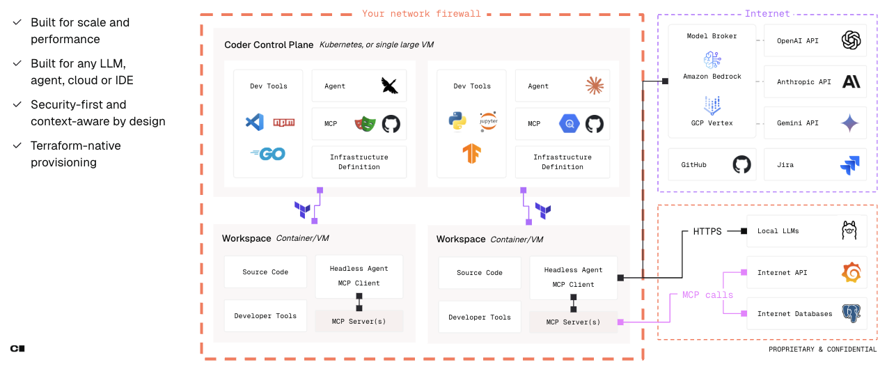

# AI-Driven Development Workflows

## Speed Up Development with Intelligent Automation

Welcome to the AI-Driven Development Workflows module! Now that you have deployed Coder and created intelligent templates, it's time to experience the future of software development. This module demonstrates how AI transforms every aspect of the development lifecycle—from initial code generation to deployment and monitoring.

### What We'll Accomplish

In this module, you will:

1. **Learn AI-Powered Coding Workflows** - Experience intelligent code generation, completion, and refactoring with Amazon Q Developer and AWS Bedrock
2. **Create Intelligent Deployment Automation** - Deploy applications using AI-powered infrastructure provisioning and optimization
3. **Build Agentic Development Workflows** - Create autonomous development agents that handle routine tasks and complex problem-solving

## The AI-First Development Philosophy

AI-driven development isn't just about code completion—it's a fundamental shift in how we approach software engineering:

### Traditional Development vs. AI-Driven Development

| Traditional Approach | AI-Driven Approach |
|---------------------|--------------------| 
| Manual code writing | AI-assisted generation with human guidance |
| Reactive debugging | Proactive issue detection and resolution |
| Manual testing | Intelligent test generation and execution |
| Static documentation | Dynamic, context-aware documentation |
| Manual code reviews | AI-enhanced reviews with security scanning |
| Reactive monitoring | Predictive analytics and automated remediation |

### Key Principles

- **Human-AI Collaboration**: AI amplifies human creativity rather than replacing it
- **Context-Aware Assistance**: AI understands your codebase, patterns, and objectives
- **Continuous Learning**: Systems improve based on team patterns and feedback
- **Proactive Intelligence**: AI anticipates needs and suggests optimizations
- **End-to-End Automation**: AI workflows span the entire development lifecycle

## Architecture Overview

Our AI-driven development platform integrates multiple AWS AI services with Coder:

## Real-World AI Development Scenarios

### Scenario 1: New Feature Development
**Traditional Time**: Weeks  
**AI-Driven Time**: Days

1. **AI Requirements Analysis**: Natural language feature description → detailed technical requirements
2. **Intelligent Code Generation**: AI generates boilerplate, API endpoints, and database schemas
3. **Automated Testing**: AI creates comprehensive test suites based on requirements
4. **Smart Code Review**: AI identifies potential issues, security vulnerabilities, and optimization opportunities
5. **Intelligent Deployment**: AI optimizes infrastructure configuration and deployment strategy

### Module Learning Objectives

By the end of this module, you will be able to:

**AI-Powered Development Skills:**
- Leverage Amazon Q Developer for intelligent code completion and generation
- Use AWS Bedrock/Anthropic Claude Code for advanced code review and architectural guidance
- Implement AI-driven refactoring and optimization workflows
- Create context-aware development assistants

> **💡 AI Development Mindset**: Think of AI as your intelligent pair programming partner. The goal is human-AI collaboration that amplifies creativity and productivity.

> **⚠️ Warning**: The examples and sample code provided in this workshop are intended to be consumed as instructional content. These examples are not intended for use in production environments.

### [Ready to Experience the Future?](./modules/ai-driven-development.md)
Let's dive into [AI-powered development](./modules/ai-driven-development.md) workflows and transform how you build software. The future of development is intelligent, automated, and incredibly productive!