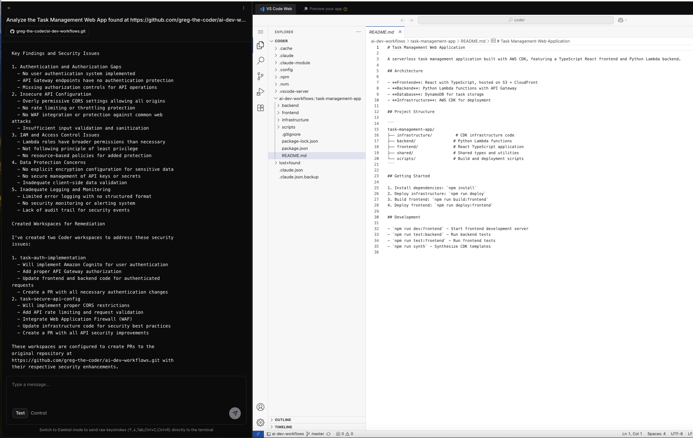
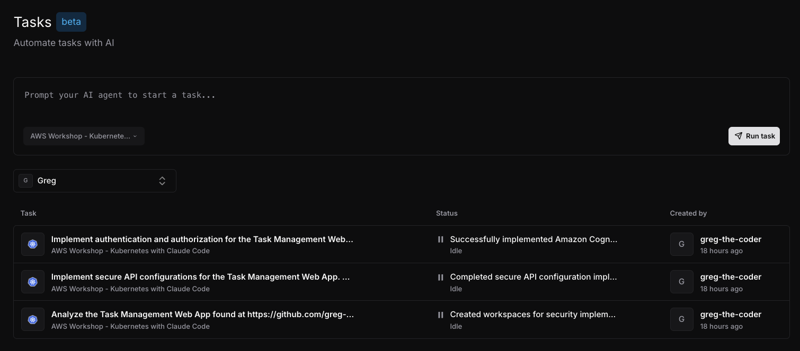

# AI-Driven Task Automation Workflows

## Transforming Development Tasks with Intelligent Automation

AI-driven automation workflows represent a potentially exponential boost to developer productivity by enabling Agentic AI to autonomously perform routine development tasks with minimal input and supervision. Instead of using precious Developer cycles, AI can automate standard SDLC tasks, allowing developers to focus on creative problem-solving and innovation.

### Workflow 2: AI-Driven Task Automation with Claude Code
#### Scenario: Perform an automated Well-Architected Review, and act on any findings

Let's create a Coder Task that will perform a Well-Architected review of the Web App we previously created.

#### Step 1: Create Your Task-Automation Workspace

Create a Task using the AWS Workshop - Kubernetes with Claude Code template:
1. **Access your Coder dashboard** and click "Tasks"
2. **Within the Task UI, Select the AWS Workshop - Kubernetes with Claude Code template from the drop-down** (created in the previous module)
3. **Configure the Task prompt**:
```bash
Analyze the Task Management Web App found at https://github.com/your-git-id/ai-dev-workflows.git, perform a Well Architected Review of the application with a focus on the Security pillar.  Create up to two additional Coder workspaces using the AWS Workshop - Kubernetes with Claude Code task template. Use the issues identified as the Task prompt for each additional workspace, and ensure the Task prompt for the new workspaces specifies that updates should be made as PRs to the original git repo at https://github.com/your-git-id/ai-dev-workflows.git
```

4. **Click "Run task"** and wait for it to start

> **ℹ️ Info**: The Coder Task UI will automatically provision a task-based workspace and Claude Code will begin analyzing the provided Task prompt.

The Claude Code Web UI in the left pane will begin by creating and updating a "To Do List" of activities to be performed.  As it progresses, you can monitor the Agent's actions.  It will most likely prompt for your approval and direction on how to move ahead to create new workspaces to resolve the identified issues. Depending on how you respond, the Agent will spawn up to two additional Tasks to remediate the findings.



#### Step 2: Monitor and review Async Task-Automation Workspaces

Once your initial Task completes:

1. **Re-open the Tasks** from your Coder dashboard
2. **Review the new Tasks** created by your initial Task-Automation workflow
3. **Open the new tasks** and monitor the changes made, and optionally submit PR's to your git repo



Take some time on your own and explore each of the created Tasks and evaluate the results of the remediation activities performed by Claude Code.  Experiment by instructing Claude Code to unit test the changes and/or smoke-test a deployment to your AWS account.

> **🚀 Workflow Automation**: These AI automation workflows can reduce time spent on routine activities, while dramatically boosting developer productivity. Start by automating one workflow and experimenting until you get consistent results. Gradually add more AI automation workflows as your team becomes comfortable with specific Agent capabilities and required prompts to get the desired results.